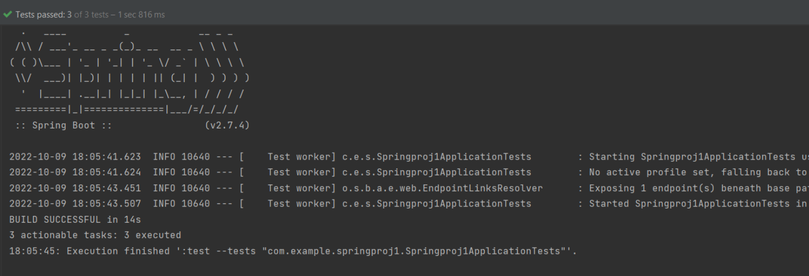

## Integration Testing
Integration testing is the second level of the software testing process comes after unit testing. In this testing, units or individual components of the software are tested in a group. The focus of the integration testing level is to expose defects at the time of interaction between integrated components or units.

## Implementation
```
    RestTemplate restTemplate = new RestTemplate();
    ResponseEntity<String> response = restTemplate.getForEntity(url, String.class);

    assertNotNull(response);
    assertTrue(response.getStatusCode() == HttpStatus.OK);
    assertEquals(MediaType.APPLICATION_JSON, response.getHeaders().getContentType());
    assertTrue(isValid(response.getBody()));
```

In the code snippet, we got the response from API. Then we checked if it is not null, response status code is OK, content type is JSON, and it is valid JSON.
We check the integration of our code with REST API with this method.

## SETUP
You can run the following commands in terminal to run the integration test and get the result:
```
    chmod +x gradlew
    ./gradlew build
    ./gradlew test
```

## TEST RESULTS


